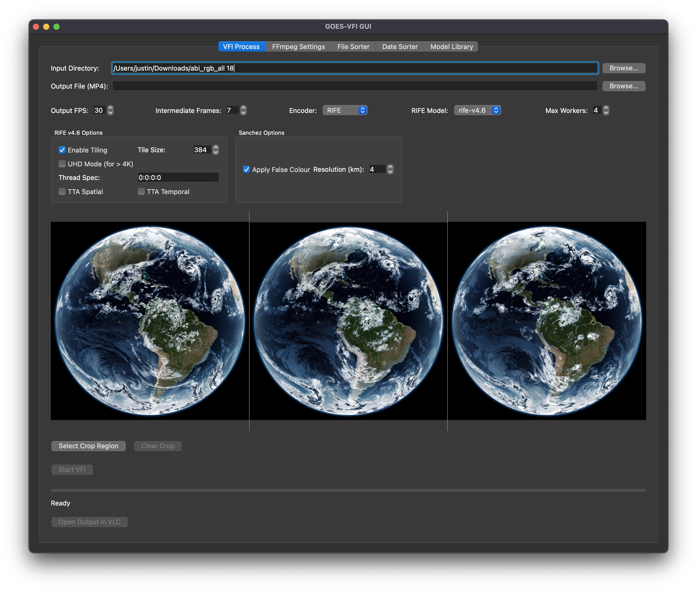

# GOES-VFI (Video Frame Interpolation for GOES Imagery)

[](https://github.com/jtn0123/GOES_VFI/tags)

A PyQt6 GUI application for applying Video Frame Interpolation (VFI) using the RIFE model to sequences of satellite images (like GOES) or any PNG sequence, creating smooth timelapse videos.

## Screenshots & Demos

### User Interface


### Sanchez Processing / False Color


### Cropping Feature Demo
[▶️ Watch video: Cropping tool in action](docs/assets/Cropping.mov)

## Features

*   **RIFE Interpolation:** Uses RIFE v4.6 (ncnn build) via the included `rife-cli` executable to generate 1 intermediate frame per original pair.
*   **RIFE Controls:** Fine-grained control over RIFE v4.6 parameters:
    *   Model selection (if multiple model folders exist).
    *   Tiling (enable/disable, tile size).
    *   UHD Mode (for >4K frames).
    *   Test-Time Augmentation (Spatial & Temporal).
    *   Thread specification (Load:Proc:Save).
*   **FFmpeg Integration:** Extensive options for processing and encoding:
    *   Motion Interpolation (`minterpolate`) via FFmpeg.
    *   Sharpening (`unsharp`) via FFmpeg.
    *   Detailed control over `minterpolate` and `unsharp` parameters.
    *   Software (libx265) and Hardware (VideoToolbox HEVC/H.264 on macOS) encoding.
    *   Quality/Bitrate/Preset controls.
    *   Pixel format selection.
    *   Option to skip FFmpeg interpolation.
*   **GUI:** Easy-to-use interface built with PyQt6.
    *   Input folder / Output file selection (output path is not saved between sessions).
    *   Image Cropping tool.
    *   "Skip AI Interpolation" option to only use original frames (can still use FFmpeg interpolation/encoding).
    *   Frame previews (first, middle, last) with clickable zoom (shows cropped view if active).
    *   FFmpeg settings profiles ("Default", "Optimal", "Optimal 2", "Custom").
    *   Progress bar and ETA display.
    *   "Open in VLC" button.
*   **Settings Persistence:** Saves UI state, input directory, crop selection, and FFmpeg settings between sessions (via `QSettings`).
*   **Debug Mode:** Run with `--debug` to keep intermediate files.

## Requirements

*   **Python:** 3.9+ recommended.
*   **Packages:** See `requirements.txt` (mainly `PyQt6`, `numpy`, `Pillow`). Install with `pip install -r requirements.txt`.
*   **FFmpeg:** Required for video processing/encoding. Must be installed and available in your system's PATH.
*   **RIFE v4.6 ncnn:** The `rife-cli` executable and associated model files (`flownet.bin`, `flownet.param`) are expected.
    *   The application looks for `rife-cli` in `goesvfi/bin/rife-cli` relative to the package installation.
    *   The model files (`flownet.bin`, `flownet.param`) need to be placed within a model directory (e.g., `goesvfi/models/rife-v4.6/`). The GUI auto-detects folders named `rife-*` in `goesvfi/models/`.
    *   *Ensure you have obtained the RIFE v4.6 ncnn executable and model files and placed them correctly.* 

## Installation

1.  **Clone the repository:**
    ```bash
    git clone https://github.com/jtn0123/GOES_VFI.git
    cd GOES_VFI
    ```
2.  **Set up a virtual environment (recommended):**
    ```bash
    python -m venv .venv
    source .venv/bin/activate  # On Windows use `.venv\Scripts\activate`
    ```
3.  **Install dependencies:**
    ```bash
    pip install -r requirements.txt
    ```
4.  **Place RIFE executable:** Put your downloaded/built `rife-cli` into the `goesvfi/bin/` directory.
5.  **Place RIFE models:** Create `goesvfi/models/rife-v4.6/` (or similar `rife-*` name) and place `flownet.bin` and `flownet.param` inside it.

## Usage

Ensure your virtual environment is activated.

Run the GUI application:

```bash
python -m goesvfi.gui [--debug]
```

**GUI Steps:**

1.  **Input folder:** Select the directory containing your sequence of PNG images.
2.  **Output MP4:** Select the desired base output file path (the application will suggest a default; a timestamp will be added automatically to the actual output file).
3.  **Crop (Optional):** Click "Crop..." to define a region on the first frame.
4.  **Adjust Settings:** 
    *   Set Target FPS.
    *   Configure RIFE v4.6 settings (Tiling, UHD, TTA, etc.) or check "Skip AI Interpolation".
    *   Select Encoder.
    *   Go to the "FFmpeg Settings" tab to choose a profile or customize FFmpeg interpolation and sharpening parameters.
5.  **Start:** Click the "Start" button.
6.  **Monitor:** Watch the progress bar and status messages.
7.  **Open:** Once finished, click "Open in VLC" (if VLC is installed and in your PATH) or open the timestamped MP4 file manually.

## Configuration

*   **RIFE Executable:** Expected at `goesvfi/bin/rife-cli`.
*   **RIFE Models:** Expected in `goesvfi/models/rife-v4.6/` (or similar).
*   **Output/Cache Directories:** Default locations are managed by `goesvfi/utils/config.py`.
*   **Persistent Settings:** Stored using `QSettings` (platform-specific location, typically `~/.config/YourOrg/GOESVFI.conf` on Linux/macOS).

## License

This project does not currently have a license. Consider adding one (e.g., MIT License).

## Contributing

Contributions are welcome! Please feel free to submit pull requests or open issues.
