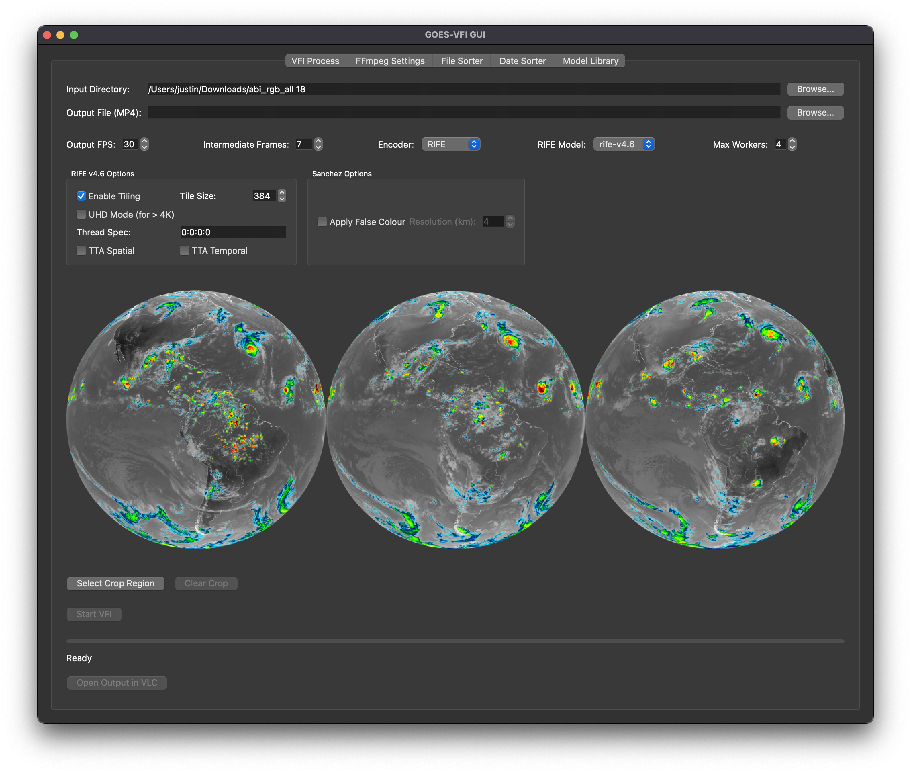

# GOES-VFI (Video Frame Interpolation for GOES Imagery)

[](https://github.com/jtn0123/GOES_VFI/tags)
[](https://github.com/jtn0123/GOES_VFI/actions/workflows/ci.yml)
[](https://codecov.io/gh/jtn0123/GOES_VFI)
[](https://github.com/jtn0123/GOES_VFI/actions)
[](https://opensource.org/licenses/MIT)
[](https://www.python.org/downloads/)

A PyQt6 GUI application for creating smooth, high-quality timelapse videos from satellite imagery using AI-powered video frame interpolation.

## What is GOES-VFI?

GOES-VFI transforms sequences of satellite images into smooth timelapse videos by intelligently generating intermediate frames between existing images. It's particularly designed for GOES (Geostationary Operational Environmental Satellites) imagery but works with any PNG image sequence.

### Key Capabilities:
- **AI Frame Interpolation**: Uses RIFE (Real-Time Intermediate Flow Estimation) v4.6 to create smooth transitions between frames
- **Satellite Image Enhancement**: Applies false color processing to infrared satellite data for better visualization
- **Professional Video Output**: Produces high-quality MP4 videos with customizable encoding settings
- **User-Friendly Interface**: Simple GUI that guides you through the entire process

## Screenshots & Demos

### User Interface


### Sanchez Processing / False Color


### Cropping Feature Demo


## Features

### Core Processing Features
*   **AI Frame Interpolation (RIFE v4.6):**
    *   Generates smooth intermediate frames between your existing images
    *   Supports various frame rates (24, 30, 60 FPS and custom)
    *   Works with images of any resolution (HD, 4K, 8K+)
    *   Fine control over processing parameters:
        *   **Tiling**: Processes large images in smaller chunks to save memory
        *   **UHD Mode**: Optimized processing for ultra-high-definition (>4K) frames
        *   **Test-Time Augmentation**: Improves quality by processing multiple variations
        *   **Thread Control**: Optimize performance for your specific hardware

*   **Video Encoding (FFmpeg):**
    *   Professional-grade video encoding with multiple options:
        *   **Software Encoding**: High-quality H.265/HEVC encoding
        *   **Hardware Encoding**: Fast encoding using GPU acceleration (macOS VideoToolbox)
    *   Additional video enhancements:
        *   **Motion Interpolation**: Further smoothing using FFmpeg's algorithms
        *   **Sharpening**: Enhance detail in the final video
        *   **Custom Bitrate/Quality**: Balance file size vs. quality

*   **Satellite Image Processing:**
    *   **Sanchez Integration**: Converts grayscale infrared satellite data to false color
    *   **GOES Data Support**: Specifically optimized for GOES-16/18 Band 13 (10.3 μm) imagery
    *   **Batch Processing**: Handle thousands of images efficiently

### User Interface Features
*   **Intuitive GUI Design:**
    *   Step-by-step workflow guides you through the process
    *   Real-time preview of first, middle, and last frames
    *   Visual crop selection tool
    *   Progress tracking with time estimates
    *   One-click playback in VLC when complete

*   **Advanced Options:**
    *   Multiple processing profiles (Default, Optimal, Custom)
    *   Skip AI interpolation for faster processing
    *   Debug mode to inspect intermediate files
    *   Batch processing capabilities

*   **Smart Features:**
    *   Automatic output filename generation with timestamps
    *   Settings persistence between sessions
    *   Intelligent default values based on your input

## Architecture Overview

GOES-VFI is structured using modern software architecture patterns to maximize maintainability and extensibility:

* **MVVM (Model-View-ViewModel):** The GUI is organized using the Model-View-ViewModel pattern, which separates the user interface (View), presentation logic (ViewModel), and backend/data processing (Model). This decoupling makes the codebase easier to test and extend.
* **Decoupled Pipeline Components:** The core processing pipeline is modular:
    * **FFmpeg Command Builder:** Constructs and manages FFmpeg command invocations for encoding and filtering.
    * **ImageProcessor Interface:** Abstracts image processing steps, with concrete implementations such as `ImageLoader`, `SanchezProcessor`, and `ImageCropper`.
    * Each pipeline stage is independently testable and replaceable, supporting future enhancements.

## Requirements

* **Python:** 3.13+ required.
* **Packages:** See `requirements.txt` (mainly `PyQt6`, `numpy`, `Pillow`). Install with `pip install -r requirements.txt`.
* **FFmpeg:** Required for video processing/encoding. Must be installed and available in your system's PATH.
* **RIFE v4.6 ncnn:** The `rife-cli` executable and associated model files (`flownet.bin`, `flownet.param`) are expected.
    * The application looks for `rife-cli` in `goesvfi/bin/rife-cli` relative to the package installation.
    * The model files (`flownet.bin`, `flownet.param`) need to be placed within a model directory (e.g., `goesvfi/models/rife-v4.6/`). The GUI auto-detects folders named `rife-*` in `goesvfi/models/`.
    * *Ensure you have obtained the RIFE v4.6 ncnn executable and model files and placed them correctly.*
* **Development Tools:** For contributors, the project uses pre-commit hooks and various linters:
    * [`black`](https://black.readthedocs.io/en/stable/) - Code formatter (line length: 88)
    * [`flake8`](https://flake8.pycqa.org/en/latest/) - Style guide enforcement
    * [`isort`](https://pycqa.github.io/isort/) - Import statement sorting
    * [`mypy`](http://mypy-lang.org/) - Static type checking
    * [`pylint`](https://pylint.org/) - Advanced code analysis
    * Install all with: `pip install -r requirements-dev.txt` (if available) or individually

## Installation

### Prerequisites
Before installing GOES-VFI, ensure you have:
- **Python 3.13 or newer** installed on your system
- **FFmpeg** installed and accessible from command line
- **Git** for cloning the repository

### Step-by-Step Installation

1.  **Clone the repository:**
    ```bash
    git clone https://github.com/jtn0123/GOES_VFI.git
    cd GOES_VFI
    ```

2.  **Create and activate a virtual environment:**

    This isolates the project dependencies from your system Python:

    **On macOS/Linux:**
    ```bash
    python3 -m venv .venv
    source .venv/bin/activate
    ```

    **On Windows:**
    ```bash
    python -m venv .venv
    .venv\Scripts\activate
    ```

    You should see `(.venv)` in your terminal prompt when activated.

3.  **Install Python dependencies:**
    ```bash
    pip install -r requirements.txt
    ```

    This installs:
    - PyQt6 (GUI framework)
    - NumPy (numerical processing)
    - Pillow (image handling)
    - pytest (testing framework)
    - And other required packages

4.  **Download and place RIFE components:**

    RIFE (Real-Time Intermediate Flow Estimation) is the AI model that performs frame interpolation.

    a. **Download RIFE executable:**
       - Get the `rife-cli` executable for your platform
       - Place it in: `goesvfi/bin/rife-cli`
       - Make it executable on macOS/Linux: `chmod +x goesvfi/bin/rife-cli`

    b. **Download RIFE model files:**
       - Create directory: `goesvfi/models/rife-v4.6/`
       - Download and place these files inside:
         - `flownet.bin` (the neural network weights)
         - `flownet.param` (the network parameters)

5.  **Verify installation:**
    ```bash
    python -m goesvfi.gui --help
    ```

    This should display the help message without errors.

## Usage

### Quick Start Guide

1. **Activate your virtual environment:**
   ```bash
   source .venv/bin/activate  # On Windows: .venv\Scripts\activate
   ```

2. **Launch the application:**
   ```bash
   python -m goesvfi.gui
   ```

   Add `--debug` flag to keep intermediate files for troubleshooting:
   ```bash
   python -m goesvfi.gui --debug
   ```

### Step-by-Step Workflow

#### 1. Select Input Images
- Click **"Browse"** next to "Input Directory"
- Navigate to a folder containing your PNG images
- Images should be:
  - Sequential (named in order: img001.png, img002.png, etc.)
  - Same resolution
  - PNG format (JPEG support planned)

#### 2. Choose Output Location
- Click **"Browse"** next to "Output File"
- Select where to save your video
- A timestamp will be automatically added to prevent overwriting

#### 3. Preview Your Images
- The interface shows three preview frames:
  - **First**: Beginning of your sequence
  - **Middle**: Midpoint frame
  - **Last**: End of sequence
- Click any preview to see it full-size

#### 4. (Optional) Crop Your Video
- Click **"Crop..."** to select a specific region
- Useful for:
  - Focusing on a specific area
  - Removing unwanted borders
  - Creating consistent framing

#### 5. Configure Processing Settings

**Main Tab Settings:**
- **Target FPS**: Choose your desired frame rate
  - 24 FPS: Cinematic look
  - 30 FPS: Standard video
  - 60 FPS: Smooth motion
  - Custom: Any value you need

- **RIFE Settings** (AI Interpolation):
  - **Enable Tiling**: For large images or limited GPU memory
  - **UHD Mode**: Optimizes for 4K+ resolution
  - **TTA**: Improves quality (slower processing)
  - **Skip AI Interpolation**: Use only original frames

- **Encoder Selection**:
  - **libx265**: Best quality, slower
  - **libx264**: Good compatibility
  - **hevc_videotoolbox**: Fast hardware encoding (macOS)

**FFmpeg Settings Tab:**
- Choose a profile or customize:
  - **Default**: Balanced settings
  - **Optimal**: Higher quality
  - **Custom**: Full control

#### 6. Start Processing
- Click **"Start"** button
- Monitor progress:
  - Progress bar shows completion
  - ETA displays estimated time
  - Status messages explain current step

#### 7. View Your Video
- When complete, click **"Open in VLC"**
- Or navigate to the output file location
- Video filename includes timestamp

## Common Use Cases

### Creating Weather Timelapses
1. Download GOES satellite imagery for your region
2. Use the Integrity Check tab to verify all timestamps
3. Process with Sanchez for false color
4. Create smooth 60 FPS video with RIFE interpolation

### Processing Existing Image Sequences
1. Place sequential PNG images in a folder
2. Launch GOES-VFI and select the folder
3. Choose frame rate and quality settings
4. Generate interpolated video

### Focusing on Specific Regions
1. Load your image sequence
2. Use the Crop tool to select your area of interest
3. Process only the selected region for faster rendering

### Batch Processing Multiple Sequences
1. Use the examples scripts for automation
2. Process multiple folders programmatically
3. Apply consistent settings across all videos

## Configuration

GOES-VFI uses a standardized configuration mechanism for core settings:

* **Primary Configuration File:**
  The main configuration is stored in a TOML file located at `~/.config/goesvfi/config.toml` (on Linux/macOS) or the platform equivalent (e.g., `%APPDATA%\goesvfi\config.toml` on Windows).
* **Configuration Management:**
  The module `goesvfi/utils/config.py` is responsible for loading this TOML file and providing default values for all core settings, such as:
    * Cache directory
    * Logging level
    * Paths to RIFE/Sanchez executables and models
    * Other pipeline and application options
* **UI State Persistence:**
  Some user interface state (such as window geometry, last-used directories, and certain UI preferences) may still be saved using `QSettings` (platform-specific location).
  **Note:** Only UI state is managed by `QSettings`; all core configuration is handled by the TOML file.
* **Defaults:**
  If the TOML file does not exist, sensible defaults are used and a new file is created on first run.

## License

This project is licensed under the MIT License. See the [LICENSE](LICENSE) file for details.

## Project Structure

The GOES-VFI project is organized with a clean directory structure to make the codebase more maintainable and easier to navigate:

### Core Package
- `goesvfi/`: Main package containing the application code
  - `bin/`: Binary executables (e.g., `rife-cli`)
  - `gui_tabs/`: PyQt6 GUI tab implementations
  - `integrity_check/`: GOES data integrity checking module
  - `models/`: Model files for RIFE and other ML components
  - `pipeline/`: Processing pipeline components
  - `utils/`: Utility modules (logging, configuration, etc.)
  - `view_models/`: ViewModels for MVVM architecture

### Test Organization
- `tests/`: All test files are organized by test type
  - `unit/`: Unit tests for individual components
  - `integration/`: Integration tests for component interactions
  - `gui/`: Tests for the PyQt6 user interface
    - `imagery/`: Tests for imagery-related GUI components
    - `tabs/`: Tests for various tab components
  - `utils/`: Test utilities and helpers
- `legacy_tests/`: Contains potentially redundant or outdated tests for evaluation

### Example Scripts
- `examples/`: Example scripts demonstrating various features
  - `download/`: Examples for downloading GOES satellite data
  - `s3_access/`: Examples for interacting with NOAA S3 buckets
  - `imagery/`: Examples of processing and rendering satellite imagery
  - `processing/`: Examples of various processing techniques
  - `visualization/`: Examples of data visualization techniques
  - `debugging/`: Examples for debugging specific functionality
  - `utilities/`: Utility scripts for code maintenance

### Documentation
- `docs/`: Documentation files
  - `assets/`: Screenshots, diagrams, and other visual assets
  - `reports/`: Detailed reports on various components
  - `testing/`: Documentation related to testing

### Development Tools
- `scripts/`: Development and utility scripts
- `run_all_tests.py`, `run_working_tests_with_mocks.py`, `run_non_gui_tests.py`, etc.: Test runner scripts
- `cleanup.py`: Script to clean up temporary and cache files

## Examples and Testing

### Examples

The repository includes various example scripts showcasing different aspects of the GOES-VFI project. These examples are located in the `examples/` directory and are organized by functionality:

* **Download Examples:** Scripts for downloading GOES satellite imagery from NOAA S3 buckets
* **S3 Access Examples:** Examples demonstrating how to interact with NOAA S3 buckets directly
* **Imagery Examples:** Examples of processing and rendering satellite imagery
* **Processing Examples:** Demonstrations of various processing techniques
* **Visualization Examples:** Examples of data visualization techniques
* **Debugging Examples:** Scripts for debugging specific functionality
* **Utilities:** Utility scripts for code maintenance

Each example can be run directly from its directory. The examples are designed to be self-contained and include appropriate documentation.

```bash
python -m examples.download.download_band13
```

### Testing

The project uses pytest for unit testing, integration testing, and GUI testing. The test suite includes **827+ tests across 87+ test files**. Tests are organized in the `tests/` directory with subdirectories for different types of tests:

* **Unit Tests:** Tests for individual components and modules
* **Integration Tests:** Tests for interactions between components
* **GUI Tests:** Tests for the PyQt6 user interface
  * **Imagery Tests:** Tests for imagery-related GUI components
  * **Tab Tests:** Tests for various tab components

Before running the tests, make sure your virtual environment is activated and all
dependencies are installed:

```bash
python -m venv .venv
source .venv/bin/activate
pip install -r requirements.txt
```

#### Test Runner Scripts

```bash
# Run all tests (recommended after fixes)
./run_all_tests.py
# Options: --debug-mode (verbose output), --parallel 4 (faster execution)

# Run all working tests with mocks (reliable subset)
./run_working_tests_with_mocks.py

# Run non-GUI tests (avoids segmentation faults)
# Dynamically discovers all non-GUI tests and runs them
# Options: --quiet, --verbose, --parallel N
./run_non_gui_tests.py

# Generate code coverage report
# Uses coverage 7.6.0 for Python 3.13 compatibility
# Creates: htmlcov/ directory, coverage.xml, coverage.json
# IMPORTANT: GUI tests may cause segfaults during coverage runs
# For best results, run coverage on non-GUI tests only
./run_coverage.py --clean  # Clean old data first
./run_coverage.py tests/unit  # Run on specific directory
./run_coverage.py tests/unit tests/integration  # Multiple directories
./run_coverage.py --open  # Open HTML report in browser after generation
./run_coverage.py --threshold 90  # Set coverage threshold (default: 80%)
./run_coverage.py --no-fail  # Don't fail on low coverage
./run_coverage.py --markers "not gui"  # Run tests matching markers
./run_coverage.py --parallel  # Run tests in parallel for speed

# Full example for CI/CD:
./run_coverage.py tests/unit tests/integration --clean --threshold 85

# Utility: Auto-add missing docstrings
# Adds placeholder "TODO" docstrings to satisfy pylint requirements
# Skips: private methods (_method), test functions (test_*)
python fix_pylint_docstrings.py <file_or_directory>
# Example: python fix_pylint_docstrings.py goesvfi/utils/

# Run specific test file
python -m pytest tests/unit/test_specific.py -v

# Run tests with timeout (useful for hanging tests)
python -m pytest tests/unit/test_file.py -v --timeout=30
```

#### Linting and Code Quality

The project maintains high code quality standards using multiple linters:

```bash
# Run all linters
python run_linters.py

# Run specific linters
python run_linters.py --flake8-only    # Style checking
python run_linters.py --black-only     # Code formatting check
python run_linters.py --mypy-only      # Type checking
python run_linters.py --pylint-only    # Advanced static analysis

# Apply formatting automatically
python run_linters.py --format

# Type checking
python -m run_mypy_checks         # Standard mode
python -m run_mypy_checks --strict # Strict mode
```

## Contributing

Contributions are welcome! Please feel free to submit pull requests or open issues.

**Guidelines for Contributors:**

* **Architecture:**
  The project uses the MVVM (Model-View-ViewModel) pattern for the GUI and a modular, decoupled pipeline for processing. Please follow these patterns when adding new features or refactoring code.
* **Project Structure:**
  - Place new code in the appropriate module within the `goesvfi` package
  - Follow the established directory structure for tests and examples
  - When developing a new feature, consider creating it first as an example script in the appropriate examples directory
* **Utilities:**
  Use the centralized logging (`goesvfi.utils.log`) and configuration (`goesvfi.utils.config`) utilities for all logging and configuration access.
* **Examples and Tests:**
  - When adding new functionality, create appropriate examples in the corresponding `examples/` subdirectory
  - Add unit tests to `tests/unit/`, integration tests to `tests/integration/`, and GUI tests to `tests/gui/`
  - Follow existing patterns for both examples and tests
  - Use the test utilities in `tests/utils/` for common testing functionality
* **Code Style and Pre-commit Hooks:**
  The project uses pre-commit hooks to maintain code quality. **Never skip pre-commit hooks with --no-verify**.

  Before submitting changes:
    ```bash
    # Run all linters
    python run_linters.py

    # Or run individually
    black .           # Format code
    isort .           # Sort imports
    flake8 .          # Check style
    mypy .            # Check types

    # Let pre-commit hooks run on commit
    git commit -m "Your message"  # DO NOT use --no-verify
    ```
* **Type Safety:**
  - Include type annotations for all function parameters and return values
  - Use mypy to check type correctness with `python -m run_mypy_checks`
* **Pull Requests:**
  Clearly describe your changes and reference any related issues or discussions
* **Data Files:**
  - Do not commit large data files (.nc files, large .png files, etc.)
  - Use the cleanup script (`cleanup.py`) to clean up temporary data files before committing
