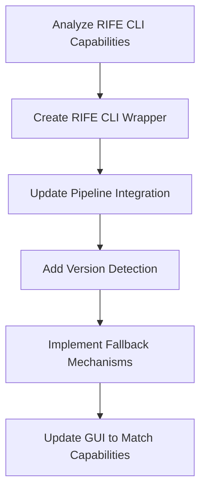
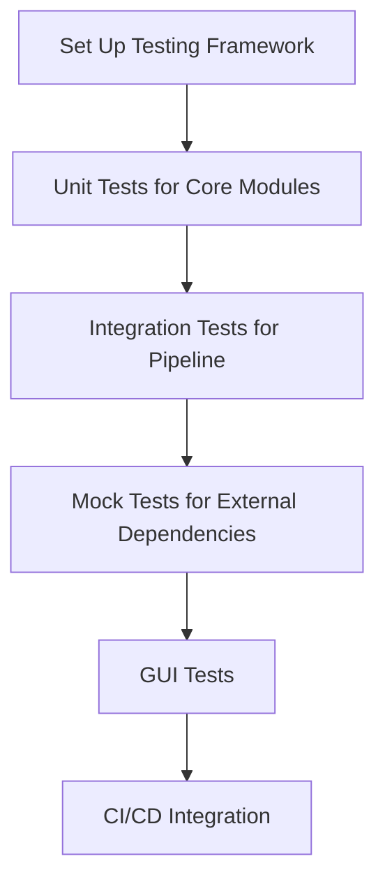
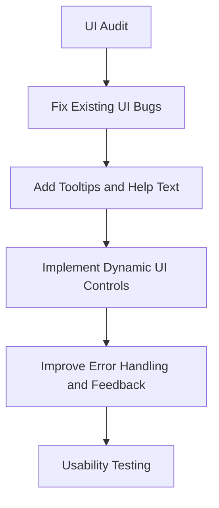
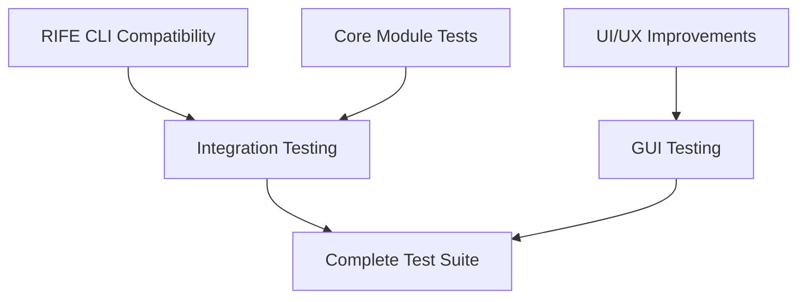

# GOES Video Frame Interpolator (GOES-VFI) Improvement Plan

This document outlines a comprehensive plan for improving the GOES Video Frame Interpolator application, addressing three key areas: RIFE CLI compatibility, testing, and UI/UX improvements.

## Table of Contents

1. [RIFE CLI Compatibility Issue](#1-rife-cli-compatibility-issue)
2. [Comprehensive Test Suite](#2-comprehensive-test-suite)
3. [UI/UX Improvements](#3-uiux-improvements)
4. [Dependencies Between Areas](#dependencies-between-areas)
5. [Implementation Timeline](#implementation-timeline)
6. [Detailed Technical Approach](#detailed-technical-approach-for-rife-cli-compatibility)

## 1. RIFE CLI Compatibility Issue

### Current Problem
The application is attempting to use command-line options with the RIFE CLI executable that it doesn't support. Specifically:
- In `goesvfi/pipeline/run_vfi.py`, the application tries to use options like `-t` (tiling), `-u` (UHD mode), `-x` (spatial TTA), `-z` (temporal TTA), and `-j` (thread specification)
- However, the RIFE CLI executable may not support these options, causing failures during execution

### Recommended Approach



#### Tasks:

1. **Analyze RIFE CLI Capabilities**
   - **Description**: Determine exactly which options the current RIFE CLI executable supports
   - **Approach**: Create a test script to run the executable with `--help` and document all supported options
   - **Priority**: High
   - **Dependencies**: None

2. **Create RIFE CLI Wrapper**
   - **Description**: Develop a robust wrapper around the RIFE CLI that handles version differences
   - **Approach**: Create a new class that detects capabilities and adapts command construction
   - **Priority**: High
   - **Dependencies**: Task 1

3. **Update Pipeline Integration**
   - **Description**: Modify the pipeline code to use the new wrapper
   - **Approach**: Refactor `run_vfi.py` and `interpolate.py` to use the new wrapper
   - **Priority**: High
   - **Dependencies**: Task 2

4. **Add Version Detection**
   - **Description**: Implement automatic detection of RIFE CLI version
   - **Approach**: Parse version information from executable output
   - **Priority**: Medium
   - **Dependencies**: Task 2

5. **Implement Fallback Mechanisms**
   - **Description**: Create fallback strategies for when certain features aren't available
   - **Approach**: Implement alternative approaches when advanced options aren't supported
   - **Priority**: Medium
   - **Dependencies**: Tasks 3, 4

6. **Update GUI to Match Capabilities**
   - **Description**: Ensure GUI only exposes options that are actually available
   - **Approach**: Dynamically enable/disable UI elements based on detected capabilities
   - **Priority**: Medium
   - **Dependencies**: Tasks 4, 5

## 2. Comprehensive Test Suite

### Current Problem
The application has minimal testing (just a placeholder test), making it difficult to ensure reliability and catch regressions.

### Recommended Approach



#### Tasks:

1. **Set Up Testing Framework**
   - **Description**: Establish a proper testing framework with pytest
   - **Approach**: Configure pytest, create test directory structure, set up fixtures
   - **Priority**: High
   - **Dependencies**: None

2. **Unit Tests for Core Modules**
   - **Description**: Create unit tests for individual modules
   - **Approach**: Write tests for `cache.py`, `tiler.py`, `loader.py`, etc.
   - **Priority**: High
   - **Dependencies**: Task 1

3. **Integration Tests for Pipeline**
   - **Description**: Test the entire pipeline flow
   - **Approach**: Create tests that verify the end-to-end process with sample images
   - **Priority**: High
   - **Dependencies**: Task 2

4. **Mock Tests for External Dependencies**
   - **Description**: Create tests that mock external dependencies like RIFE CLI and FFmpeg
   - **Approach**: Use pytest's monkeypatch and mock libraries
   - **Priority**: Medium
   - **Dependencies**: Tasks 2, 3

5. **GUI Tests**
   - **Description**: Test the GUI functionality
   - **Approach**: Use PyQt test framework or pytest-qt
   - **Priority**: Medium
   - **Dependencies**: Task 1

6. **CI/CD Integration**
   - **Description**: Set up continuous integration for automated testing
   - **Approach**: Configure GitHub Actions or similar CI service
   - **Priority**: Low
   - **Dependencies**: Tasks 1-5

## 3. UI/UX Improvements

### Current Problem
The UI has several issues including lack of tooltips, inconsistent enabling/disabling of UI elements, and specific bugs like the Tile Size spinbox not visually updating.

### Recommended Approach



#### Tasks:

1. **UI Audit**
   - **Description**: Conduct a comprehensive review of the UI
   - **Approach**: Document all UI elements, their behavior, and issues
   - **Priority**: High
   - **Dependencies**: None

2. **Fix Existing UI Bugs**
   - **Description**: Address known UI bugs like the Tile Size spinbox issue
   - **Approach**: Debug and fix each issue individually
   - **Priority**: High
   - **Dependencies**: Task 1

3. **Add Tooltips and Help Text**
   - **Description**: Improve user guidance with tooltips
   - **Approach**: Add tooltips to all settings and controls
   - **Priority**: Medium
   - **Dependencies**: Task 1

4. **Implement Dynamic UI Controls**
   - **Description**: Make UI elements respond appropriately to state changes
   - **Approach**: Refactor signal/slot connections and update logic
   - **Priority**: Medium
   - **Dependencies**: Tasks 1, 2

5. **Improve Error Handling and Feedback**
   - **Description**: Enhance user feedback for errors and processing status
   - **Approach**: Implement better error messages and status updates
   - **Priority**: Medium
   - **Dependencies**: Tasks 2, 4

6. **Usability Testing**
   - **Description**: Test the improved UI with users
   - **Approach**: Create test scenarios and gather feedback
   - **Priority**: Low
   - **Dependencies**: Tasks 2-5

## Dependencies Between Areas



## Implementation Timeline

### Phase 1: Critical Fixes (1-2 weeks)
- Analyze RIFE CLI capabilities
- Create RIFE CLI wrapper
- Update pipeline integration
- Set up testing framework
- Fix critical UI bugs

### Phase 2: Robustness (2-3 weeks)
- Add version detection
- Implement fallback mechanisms
- Develop unit tests for core modules
- Add tooltips and help text
- Implement dynamic UI controls

### Phase 3: Completeness (3-4 weeks)
- Complete integration tests
- Develop mock tests
- Improve error handling and feedback
- Update GUI to match capabilities
- Conduct usability testing

### Phase 4: Finalization (1-2 weeks)
- Set up CI/CD integration
- Implement GUI tests
- Final testing and bug fixes
- Documentation updates

## Detailed Technical Approach for RIFE CLI Compatibility

The most critical issue is the RIFE CLI compatibility. Here's a more detailed technical approach:

1. **Create a RifeCapabilityDetector class**:
   ```python
   class RifeCapabilityDetector:
       def __init__(self, exe_path: pathlib.Path):
           self.exe_path = exe_path
           self._capabilities = self._detect_capabilities()
           
       def _detect_capabilities(self) -> Dict[str, bool]:
           # Run with --help and parse output
           # Return dictionary of supported features
           
       def supports_tiling(self) -> bool:
           return self._capabilities.get('tiling', False)
           
       # Other capability methods...
   ```

2. **Create an enhanced RifeCommandBuilder**:
   ```python
   class RifeCommandBuilder:
       def __init__(self, exe_path: pathlib.Path):
           self.exe_path = exe_path
           self.detector = RifeCapabilityDetector(exe_path)
           
       def build_command(self, 
                         input_frame1: pathlib.Path,
                         input_frame2: pathlib.Path,
                         output_path: pathlib.Path,
                         options: Dict[str, Any]) -> List[str]:
           # Build command based on capabilities
           cmd = [str(self.exe_path)]
           
           # Add required arguments
           cmd.extend(['-0', str(input_frame1)])
           cmd.extend(['-1', str(input_frame2)])
           cmd.extend(['-o', str(output_path)])
           
           # Add optional arguments based on capabilities
           if options.get('tile_enable') and self.detector.supports_tiling():
               cmd.extend(['-t', str(options.get('tile_size', 256))])
           
           # Handle other options...
           
           return cmd
   ```

3. **Update RifeBackend to use the new builder**:
   ```python
   class RifeBackend:
       def __init__(self, exe_path: pathlib.Path):
           self.exe = exe_path
           self.command_builder = RifeCommandBuilder(exe_path)
           
       def interpolate_pair(self,
                           img1: NDArray[np.float32],
                           img2: NDArray[np.float32],
                           options: Dict[str, Any] = None) -> NDArray[np.float32]:
           # Use command builder to generate command
           # Rest of the method remains similar
   ```

This approach will make the application more robust against variations in the RIFE CLI executable's capabilities.