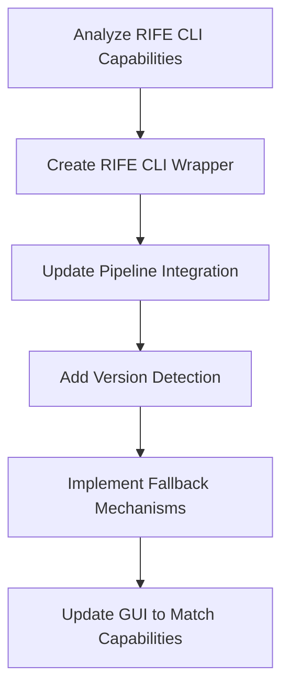
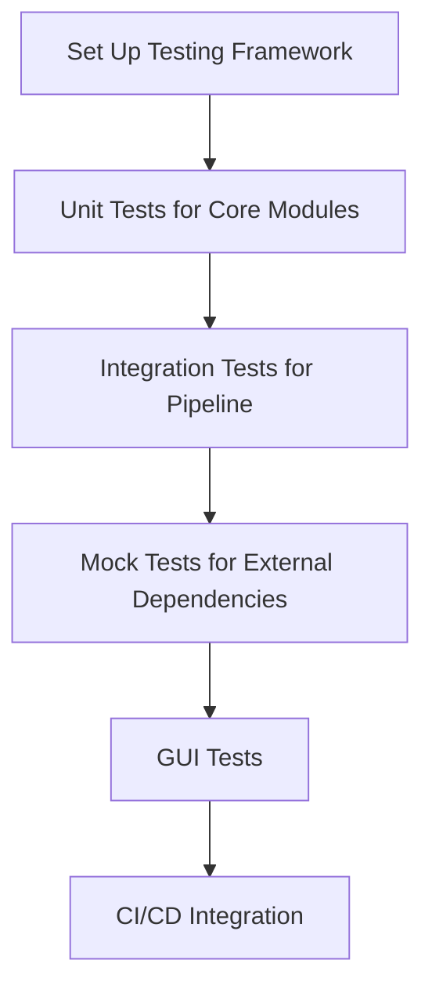
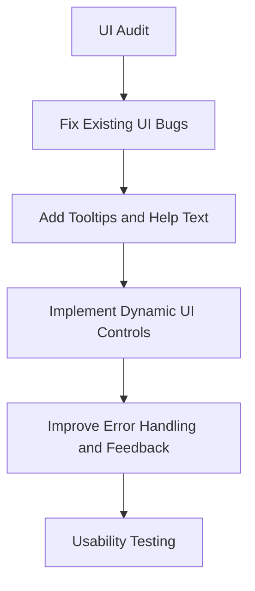

# GOES Video Frame Interpolator (GOES-VFI) Improvement Plan

This document outlines a comprehensive plan for improving the GOES Video Frame Interpolator application, addressing key areas: RIFE CLI compatibility, testing, UI/UX improvements, and the integration of FileSorter and DateSorter tools.

## Table of Contents

1.  [RIFE CLI Compatibility Issue](#1-rife-cli-compatibility-issue)
2.  [Comprehensive Test Suite](#2-comprehensive-test-suite)
3.  [UI/UX Improvements](#3-uiux-improvements)
4.  [FileSorter & DateSorter Integration](#4-filesorter--datesorter-integration)
    *   [Context and Goal](#context-and-goal)
    *   [Revised Integration Strategy](#revised-integration-strategy)
    *   [Directory Structure](#directory-structure)
    *   [Dependency Management](#dependency-management)
    *   [Potential Challenges](#potential-challenges)
    *   [Integration Tasks (Phase 1 & 2)](#integration-tasks-phase-1--2)
    *   [Phase 3: Tab Implementation and Enhancements](#phase-3-tab-implementation-and-enhancements) <!-- New Subsection -->
5.  [Dependencies Between Areas](#5-dependencies-between-areas)
6.  [Implementation Timeline](#6-implementation-timeline)
7.  [Detailed Technical Approach for RIFE CLI Compatibility](#7-detailed-technical-approach-for-rife-cli-compatibility)

## 1. RIFE CLI Compatibility Issue

### Current Problem
The application is attempting to use command-line options with the RIFE CLI executable that it doesn't support. Specifically:
- In `goesvfi/pipeline/run_vfi.py`, the application tries to use options like `-t` (tiling), `-u` (UHD mode), `-x` (spatial TTA), `-z` (temporal TTA), and `-j` (thread specification)
- However, the RIFE CLI executable may not support these options, causing failures during execution

### Recommended Approach



#### Tasks:

1.  **Analyze RIFE CLI Capabilities**
    *   **Description**: Determine exactly which options the current RIFE CLI executable supports
    *   **Approach**: Create a test script to run the executable with `--help` and document all supported options
    *   **Priority**: High
    *   **Dependencies**: None
2.  **Create RIFE CLI Wrapper**
    *   **Description**: Develop a robust wrapper around the RIFE CLI that handles version differences
    *   **Approach**: Create a new class that detects capabilities and adapts command construction
    *   **Priority**: High
    *   **Dependencies**: Task 1.1
3.  **Update Pipeline Integration**
    *   **Description**: Modify the pipeline code to use the new wrapper
    *   **Approach**: Refactor `run_vfi.py` and `interpolate.py` to use the new wrapper
    *   **Priority**: High
    *   **Dependencies**: Task 1.2
4.  **Add Version Detection**
    *   **Description**: Implement automatic detection of RIFE CLI version
    *   **Approach**: Parse version information from executable output
    *   **Priority**: Medium
    *   **Dependencies**: Task 1.2
5.  **Implement Fallback Mechanisms**
    *   **Description**: Create fallback strategies for when certain features aren't available
    *   **Approach**: Implement alternative approaches when advanced options aren't supported
    *   **Priority**: Medium
    *   **Dependencies**: Tasks 1.3, 1.4
6.  **Update GUI to Match Capabilities**
    *   **Description**: Ensure GUI only exposes options that are actually available
    *   **Approach**: Dynamically enable/disable UI elements based on detected capabilities
    *   **Priority**: Medium
    *   **Dependencies**: Tasks 1.4, 1.5

## 2. Comprehensive Test Suite

### Current Problem
The application has minimal testing (just a placeholder test), making it difficult to ensure reliability and catch regressions.

### Recommended Approach



#### Tasks:

1.  **Set Up Testing Framework**
    *   **Description**: Establish a proper testing framework with pytest
    *   **Approach**: Configure pytest, create test directory structure, set up fixtures
    *   **Priority**: High
    *   **Dependencies**: None
2.  **Unit Tests for Core Modules**
    *   **Description**: Create unit tests for individual modules
    *   **Approach**: Write tests for `cache.py`, `tiler.py`, `loader.py`, etc.
    *   **Priority**: High
    *   **Dependencies**: Task 2.1
3.  **Integration Tests for Pipeline**
    *   **Description**: Test the entire pipeline flow
    *   **Approach**: Create tests that verify the end-to-end process with sample images
    *   **Priority**: High
    *   **Dependencies**: Task 2.2
4.  **Mock Tests for External Dependencies**
    *   **Description**: Create tests that mock external dependencies like RIFE CLI and FFmpeg
    *   **Approach**: Use pytest's monkeypatch and mock libraries
    *   **Priority**: Medium
    *   **Dependencies**: Tasks 2.2, 2.3
5.  **GUI Tests**
    *   **Description**: Test the GUI functionality
    *   **Approach**: Use PyQt test framework or pytest-qt
    *   **Priority**: Medium
    *   **Dependencies**: Task 2.1
6.  **CI/CD Integration**
    *   **Description**: Set up continuous integration for automated testing
    *   **Approach**: Configure GitHub Actions or similar CI service
    *   **Priority**: Low
    *   **Dependencies**: Tasks 2.1-2.5

## 3. UI/UX Improvements

### Current Problem
The UI has several issues including lack of tooltips, inconsistent enabling/disabling of UI elements, and specific bugs like the Tile Size spinbox not visually updating.

### Recommended Approach



#### Tasks:

1.  **UI Audit**
    *   **Description**: Conduct a comprehensive review of the UI
    *   **Approach**: Document all UI elements, their behavior, and issues
    *   **Priority**: High
    *   **Dependencies**: None
2.  **Fix Existing UI Bugs**
    *   **Description**: Address known UI bugs like the Tile Size spinbox issue
    *   **Approach**: Debug and fix each issue individually
    *   **Priority**: High
    *   **Dependencies**: Task 3.1
3.  **Add Tooltips and Help Text**
    *   **Description**: Improve user guidance with tooltips
    *   **Approach**: Add tooltips to all settings and controls
    *   **Priority**: Medium
    *   **Dependencies**: Task 3.1
4.  **Implement Dynamic UI Controls**
    *   **Description**: Make UI elements respond appropriately to state changes
    *   **Approach**: Refactor signal/slot connections and update logic
    *   **Priority**: Medium
    *   **Dependencies**: Tasks 3.1, 3.2
5.  **Improve Error Handling and Feedback**
    *   **Description**: Enhance user feedback for errors and processing status
    *   **Approach**: Implement better error messages and status updates
    *   **Priority**: Medium
    *   **Dependencies**: Tasks 3.2, 3.4
6.  **Usability Testing**
    *   **Description**: Test the improved UI with users
    *   **Approach**: Create test scenarios and gather feedback
    *   **Priority**: Low
    *   **Dependencies**: Tasks 3.2-3.5

## 4. FileSorter & DateSorter Integration

### Context and Goal
Integrate the functionalities of the standalone FileSorter and DateSorter tools into the main GOES-VFI application to provide a unified user experience. Initial research confirmed the GUI toolkit landscape:
- **FileSorter:** PyQt5
- **DateSorter:** Tkinter
- **GOES-VFI:** PyQt6

This disparity, particularly DateSorter's Tkinter base, makes direct GUI migration impractical and undesirable for maintaining UI consistency within the PyQt6-based GOES-VFI.

### Revised Integration Strategy

The integration will focus on leveraging the core sorting logic while building a native PyQt6 interface within GOES-VFI.

```mermaid
graph TD
    A[GOES-VFI Main Window (PyQt6)] --> B(QTabWidget);
    B --> C{FileSorter Tab (New PyQt6 QWidget)};
    B --> D{DateSorter Tab (New PyQt6 QWidget)};
    C --> E[FileSorter Logic (sorter.py)];
    D --> F[DateSorter Logic (sorter.py)];
```

**Key Points:**

1.  **Core Logic Reuse:** The existing `sorter.py` files from both FileSorter and DateSorter, containing the essential file/date sorting algorithms, will be preserved and utilized.
2.  **New PyQt6 GUI Tabs:** Instead of migrating or rewriting the original PyQt5 and Tkinter GUIs, new GUI components will be developed as `QWidget` subclasses using PyQt6. These will be integrated as separate tabs within the main GOES-VFI `QTabWidget`.
3.  **Direct Logic Interaction:** The new PyQt6 tabs will directly import and call the necessary functions or methods from the respective `sorter.py` logic files.
4.  **UI Consistency:** This approach ensures a consistent look, feel, and behavior across all parts of the GOES-VFI application, as all UI elements will be native PyQt6.
5.  **Avoid Migration Complexity:** This strategy bypasses the significant challenges associated with migrating a Tkinter GUI to PyQt6 and avoids potential conflicts between different Qt versions (PyQt5 vs. PyQt6).

### Directory Structure

The core logic and any necessary helper modules from FileSorter and DateSorter will be placed within the `goesvfi` package, maintaining separation:

- `goesvfi/file_sorter/sorter.py` (and potentially other non-GUI modules)
- `goesvfi/date_sorter/sorter.py` (and potentially other non-GUI modules)

The *new* PyQt6 GUI tab widgets will reside within the main `goesvfi` GUI structure (e.g., potentially in a `goesvfi/tabs/` subdirectory or directly within `goesvfi/gui.py` initially, depending on complexity). The original `gui.py` files from FileSorter and DateSorter will *not* be migrated or used.

### Dependency Management

- **GUI Toolkit:** PyQt6 will remain the sole GUI toolkit dependency for the integrated GOES-VFI application.
- **Other Dependencies:** Non-GUI dependencies from FileSorter and DateSorter will be reviewed and merged into GOES-VFI's `requirements.txt` or `pyproject.toml`, ensuring compatibility and avoiding conflicts.

### Potential Challenges

- **GUI Development Effort:** While avoiding migration complexity, this approach requires effort to design, implement, and test the new PyQt6 GUI tabs for both sorters.
- **Logic Interface:** Ensuring the new PyQt6 GUIs correctly interface with the existing `sorter.py` logic, potentially requiring minor refactoring or adaptation of the logic modules for cleaner integration.
- **Testing:** Integration tests will be needed to verify that the new tabs correctly utilize the sorting logic and function as expected within the main application.

### Integration Tasks (Phase 1 & 2)
*(Renamed from "Integration Tasks (To be added to Timeline)" for clarity)*

1.  **Refactor/Prepare Sorter Logic:** Adapt `FileSorter-main/src/filesorter/sorter.py` and `DateSorter-main/src/filesorter/sorter.py` for use within `goesvfi` (e.g., adjust imports, ensure functions/classes are easily callable). Place them in `goesvfi/file_sorter/` and `goesvfi/date_sorter/`. *(Completed)*
2.  **Design FileSorter GUI Tab:** Design the UI layout and components for the FileSorter tab in PyQt6. *(Basic structure completed)*
3.  **Implement FileSorter GUI Tab:** Develop the PyQt6 `QWidget` for the FileSorter tab, connecting UI elements to the logic in `goesvfi/file_sorter/sorter.py`. *(Basic structure completed)*
4.  **Design DateSorter GUI Tab:** Design the UI layout and components for the DateSorter tab in PyQt6. *(Basic structure completed)*
5.  **Implement DateSorter GUI Tab:** Develop the PyQt6 `QWidget` for the DateSorter tab, connecting UI elements to the logic in `goesvfi/date_sorter/sorter.py`. *(Basic structure completed)*
6.  **Integrate Tabs into Main GUI:** Add the new FileSorter and DateSorter tabs to the main `QTabWidget` in `goesvfi/gui.py`. *(Completed)*
7.  **Merge Dependencies:** Update project dependencies (`requirements.txt`/`pyproject.toml`) to include necessary non-GUI libraries from FileSorter and DateSorter. *(Completed)*
8.  **Write Integration Tests:** Develop tests to verify the functionality of the integrated sorter tabs. *(Deferred to Phase 4)*

### Phase 3: Tab Implementation and Enhancements

This phase focuses on fully connecting the GUI tabs to their respective backend logic, enhancing the user interface and features, and establishing a testing strategy for these components.

#### 4.1 Connecting Logic (Midlevel/Senior Task)

**Goal:** Implement the interaction between the GUI elements and the sorter logic, ensuring background processing to prevent UI freezes.

**Tasks:**

1.  **FileSorterTab (`goesvfi/file_sorter/gui_tab.py`):**
    *   Implement `_browse_source` and `_browse_destination` methods using `QFileDialog.getExistingDirectory` to populate `source_line_edit` and `destination_line_edit`. Connect these methods to the respective "Browse..." buttons.
    *   Refactor `FileSorter.sort_files` (`goesvfi/file_sorter/sorter.py`) or create a new method to accept explicit `source_dir` and `destination_dir` arguments instead of assuming `root_dir` and a fixed `converted` subfolder. Ensure it still uses the progress callback.
    *   Implement `_start_sorting`:
        *   Retrieve source and destination paths from the line edits. Perform basic validation (e.g., check if paths exist).
        *   Create a `QThread` and a worker object (e.g., `FileSorterWorker(QObject)`) that takes the `FileSorter` instance (or just the paths) and runs the adapted `sort_files` method in its `run()` method.
        *   Define signals on the worker: `progress(int, str)`, `finished(dict)`, `error(str)`.
        *   Connect the worker's signals to slots in `FileSorterTab` to update a status bar/label and handle completion/errors.
        *   Connect the `FileSorter`'s `progress_callback` to the worker's `progress` signal.
        *   Move the worker to the thread and start the thread when the "Sort Files" button is clicked. Disable the button while running.
2.  **DateSorterTab (`goesvfi/date_sorter/gui_tab.py`):**
    *   Refactor `DateSorter` logic (`goesvfi/date_sorter/sorter.py`):
        *   Extract the core analysis logic from the `main` function into a class (e.g., `DateScanner`) or a callable function (e.g., `scan_directory(source_dir, interval_minutes, progress_callback, status_callback)`).
        *   Ensure the refactored logic uses callbacks (`progress_callback`, `status_callback`) for updates instead of printing directly.
    *   Implement `_start_scan`:
        *   Retrieve the source path from `source_line_edit`. Validate the path.
        *   Retrieve interval settings (once UI elements are added - see Feature Enhancements).
        *   Create a `QThread` and a worker object (e.g., `DateScanWorker(QObject)`) similar to FileSorter's.
        *   Define signals on the worker: `progress(int)`, `status_update(str)`, `finished(str)`, `error(str)`.
        *   Connect the worker's signals to slots in `DateSorterTab` to update UI elements (progress bar, log area).
        *   Connect the refactored `DateSorter` logic's callbacks to the worker's signals.
        *   Move the worker to the thread and start it when the "Scan Folder" button is clicked. Disable the button while running.

#### 4.2 UI Enhancements (Designer Task)

**Goal:** Improve the visual layout, usability, and consistency of the sorter tabs.

**Tasks:**

1.  **General Layout:**
    *   Review spacing and alignment within both tabs for better visual appeal and consistency with the main VFI tab.
    *   Use `QGroupBox` to group related controls (e.g., Source Folder selection, Destination Folder selection, Options).
2.  **FileSorterTab:**
    *   Add a `QStatusBar` or `QLabel` at the bottom to display progress messages and completion status.
    *   Consider adding a `QProgressBar`.
3.  **DateSorterTab:**
    *   Add a `QProgressBar` to show scan progress.
    *   Add a `QTextEdit` (read-only) or similar widget to display the status updates and the final calendar/summary output from the `status_callback`.
    *   Organize the "Interval Scanning Options" placeholder into actual controls (see Feature Enhancements).

#### 4.3 Feature Enhancements (Midlevel/Senior Task)

**Goal:** Add valuable features based on original READMEs and potential user needs.

**Tasks:**

1.  **FileSorter:**
    *   **(Optional) Date Format Detection:** If sorting logic needs to handle different date formats in folder names beyond `YYYY-MM-DD_hh-mm-ss`, add an option (e.g., QComboBox) to select expected format or implement auto-detection. *(Low Priority - current logic seems fixed)*.
    *   **Duplicate Handling Options:** Add radio buttons or a dropdown (`QComboBox`) to let the user choose behavior when a destination file exists: `Skip` (current default), `Overwrite`, `Rename`. Modify `copy_file_with_buffer` or the calling logic in `sort_files` to implement this.
    *   **Dry Run Mode:** Add a `QCheckBox` for "Dry Run". If checked, `_start_sorting` should run the logic to identify files and potential actions but *not* perform any actual copying or folder creation. Log the intended actions instead.
2.  **DateSorter:**
    *   **Interval Scanning UI:** Replace the "Interval Scanning Options (Placeholder)" label with:
        *   A `QSpinBox` or `QComboBox` to select/enter the desired `interval_minutes` (defaulting to 30 or the auto-detected value).
        *   Potentially a `QCheckBox` to enable/disable the interval scan if it's considered optional alongside other potential future scans.
    *   **Progress/Log Display:** Ensure the `QTextEdit` added in UI Enhancements effectively displays the detailed output (calendar view, summary) from the `scan_directory` logic via the `status_update` signal.

#### 4.4 Testing Strategy

**Goal:** Define how the integrated sorter components will be tested.

**Tasks:**

1.  **Unit Tests (`tests/unit/`):**
    *   Write `pytest` unit tests for the refactored `FileSorter.sort_files` (or the new method) covering different scenarios (empty source, existing destination, duplicate handling options, dry run). Use `pathlib.Path.mkdir`, `pathlib.Path.touch` and potentially `tmp_path` fixture.
    *   Write `pytest` unit tests for the refactored `DateScanner` class or `scan_directory` function, covering different file sets (no files, files with valid/invalid names, various intervals, missing intervals). Mock `Path.rglob` and `datetime.strptime` as needed.
2.  **GUI Interaction Tests (`tests/gui/`):**
    *   Use `pytest-qt` to write tests for `FileSorterTab` and `DateSorterTab`.
    *   Simulate button clicks (Browse, Sort/Scan).
    *   Verify that `QFileDialog` is called (mock it).
    *   Verify that line edits are populated correctly.
    *   Mock the backend worker threads (`FileSorterWorker`, `DateScanWorker`) to test signal emissions and UI updates (progress bar, status label/text edit) without running the full logic.
    *   Test enabling/disabling of buttons during operation.

## 5. Dependencies Between Areas

```mermaid
flowchart TD
    subgraph Core Improvements
        A[RIFE CLI Compatibility]
        B[UI/UX Improvements]
        C[Core Module Tests]
    end

    subgraph Integration
        G[Sorter Integration]
    end

    subgraph Testing
        D[Pipeline Integration Testing]
        E[GUI Testing]
        F[Complete Test Suite]
        H[Sorter Integration Testing]
    end

    A --> D
    B --> E
    C --> D
    G --> H
    G --> E # GUI tests needed for new tabs
    D --> F
    E --> F
    H --> F
```
*Note: Sorter Integration depends on having a stable base (Core Module Tests might be beneficial if logic needs refactoring). GUI Testing depends on both base UI/UX improvements and the new Sorter Integration tabs.*

## 6. Implementation Timeline
*(Adjust Phase 3 and subsequent phases to accommodate these new tasks)*

### Phase 1: Foundation & Critical Fixes (1-2 weeks)
... (Completed) ...

### Phase 2: Sorter Integration - Basic Structure (3-4 weeks)
... (Completed - Tasks 4.1-4.7 from original plan) ...

### Phase 3: Sorter Tabs - Implementation & Enhancements (3-4 weeks) *(New Phase Definition)*
- Implement FileSorterTab Logic Connection (Task 4.1.1)
- Implement DateSorterTab Logic Connection & Refactor (Task 4.1.2)
- Implement FileSorter Feature Enhancements (Duplicates, Dry Run) (Task 4.3.1)
- Implement DateSorter Feature Enhancements (Interval UI) (Task 4.3.2)
- Implement Basic UI Enhancements (Grouping, Status/Progress Widgets) (Task 4.2)
- Write Unit Tests for Sorter Logic (Task 4.4.1)

### Phase 4: Robustness & Core Testing (2-3 weeks) *(Renumbered, original Phase 3 content)*
- Add RIFE version detection (Task 1.4)
- Implement RIFE fallback mechanisms (Task 1.5)
- Develop unit tests for core VFI modules (Task 2.2)
- Add tooltips and help text (Task 3.3)
- Implement dynamic UI controls (Task 3.4)
- Develop pipeline integration tests (Task 2.3)

### Phase 5: Completeness & Advanced Testing (3-4 weeks) *(Renumbered, original Phase 4 content + Sorter GUI Tests)*
- Develop mock tests for external dependencies (Task 2.4)
- Improve error handling and feedback (Task 3.5)
- Update GUI to match RIFE capabilities (Task 1.6)
- Write Sorter Integration GUI Tests (Task 4.4.2) *(Moved from original Task 4.8)*
- Conduct usability testing (Task 3.6)

### Phase 6: Finalization (1-2 weeks) *(Renumbered, original Phase 5 content)*
- Set up CI/CD integration (Task 2.6)
- Implement core GUI tests (Task 2.5) *(If separate from Sorter GUI tests)*
- Final testing and bug fixes
- Documentation updates

## 7. Detailed Technical Approach for RIFE CLI Compatibility

The most critical issue is the RIFE CLI compatibility. Here's a more detailed technical approach:

1.  **Create a RifeCapabilityDetector class**:
    ```python
    import pathlib
    from typing import Dict, Any, List
    import subprocess
    import numpy as np
    from numpy.typing import NDArray

    class RifeCapabilityDetector:
        def __init__(self, exe_path: pathlib.Path):
            self.exe_path = exe_path
            self._capabilities = self._detect_capabilities()

        def _detect_capabilities(self) -> Dict[str, bool]:
            # Placeholder: Actual implementation needs to run the exe
            # with --help or similar and parse the output.
            # Example: Check if '-t' is mentioned in help text.
            try:
                # Example: run 'rife-cli --help' and capture output
                # result = subprocess.run([str(self.exe_path), '--help'], capture_output=True, text=True, check=True)
                # help_text = result.stdout
                # capabilities = {
                #     'tiling': '-t ' in help_text,
                #     'uhd': '-u ' in help_text,
                #     'tta': '-x ' in help_text or '-z ' in help_text,
                #     # Add other detections...
                # }
                # For now, assume defaults based on common versions
                return {'tiling': True, 'uhd': True, 'tta': True} # Adjust based on actual analysis
            except Exception:
                # Fallback if detection fails
                return {'tiling': False, 'uhd': False, 'tta': False}


        def supports_tiling(self) -> bool:
            return self._capabilities.get('tiling', False)

        def supports_uhd(self) -> bool:
            return self._capabilities.get('uhd', False)

        def supports_tta(self) -> bool:
            return self._capabilities.get('tta', False)

        # Other capability methods...
    ```

2.  **Create an enhanced RifeCommandBuilder**:
    ```python
    class RifeCommandBuilder:
        def __init__(self, exe_path: pathlib.Path):
            self.exe_path = exe_path
            self.detector = RifeCapabilityDetector(exe_path)

        def build_command(self,
                          input_frame1: pathlib.Path,
                          input_frame2: pathlib.Path,
                          output_path: pathlib.Path,
                          options: Dict[str, Any]) -> List[str]:
            # Build command based on capabilities
            cmd = [str(self.exe_path)]

            # Add required arguments (assuming -i input -o output model)
            # Adjust if RIFE CLI uses different base syntax like -0, -1
            # cmd.extend(['-i', str(input_frame1), str(input_frame2)]) # Example if -i takes multiple inputs
            cmd.extend(['-0', str(input_frame1)]) # Assuming original -0, -1 syntax
            cmd.extend(['-1', str(input_frame2)])
            cmd.extend(['-o', str(output_path)])

            # Add optional arguments based on capabilities
            if options.get('tile_enable') and self.detector.supports_tiling():
                cmd.extend(['-t', str(options.get('tile_size', 256))])
            if options.get('uhd_mode') and self.detector.supports_uhd():
                cmd.extend(['-u'])
            if options.get('tta_spatial') and self.detector.supports_tta():
                 cmd.extend(['-x']) # Assuming -x for spatial TTA
            # Add other options like model path (-m), GPU ID (-g), threads (-j) if applicable

            return cmd
    ```

3.  **Update RifeBackend (or equivalent in `run_vfi.py`/`interpolate.py`) to use the new builder**:
    ```python
    # Example within a hypothetical RifeBackend class or directly in pipeline functions
    class RifeBackend: # Or adapt existing functions
        def __init__(self, exe_path: pathlib.Path):
            self.exe = exe_path
            self.command_builder = RifeCommandBuilder(exe_path)

        def interpolate_pair(self,
                           frame1_path: pathlib.Path, # Pass paths now
                           frame2_path: pathlib.Path,
                           output_path: pathlib.Path,
                           options: Dict[str, Any] = None) -> None: # Returns None, process runs externally
            if options is None:
                options = {}

            # Use command builder to generate command
            command = self.command_builder.build_command(
                frame1_path, frame2_path, output_path, options
            )

            # Execute the command using subprocess
            try:
                print(f"Executing RIFE command: {' '.join(command)}")
                # Add error handling, logging, etc.
                subprocess.run(command, check=True, capture_output=True, text=True)
                print(f"RIFE execution successful for {output_path.name}")
            except subprocess.CalledProcessError as e:
                print(f"RIFE execution failed for {output_path.name}:")
                print(f"Command: {' '.join(e.cmd)}")
                print(f"Return Code: {e.returncode}")
                print(f"Stderr: {e.stderr}")
                print(f"Stdout: {e.stdout}")
                # Re-raise or handle error appropriately
                raise
            except FileNotFoundError:
                 print(f"Error: RIFE executable not found at {self.exe}")
                 raise

    # Usage example:
    # rife_backend = RifeBackend(pathlib.Path("path/to/rife-cli"))
    # rife_backend.interpolate_pair(path1, path2, out_path, {'tile_enable': True, 'tile_size': 128})
    ```

This approach will make the application more robust against variations in the RIFE CLI executable's capabilities.